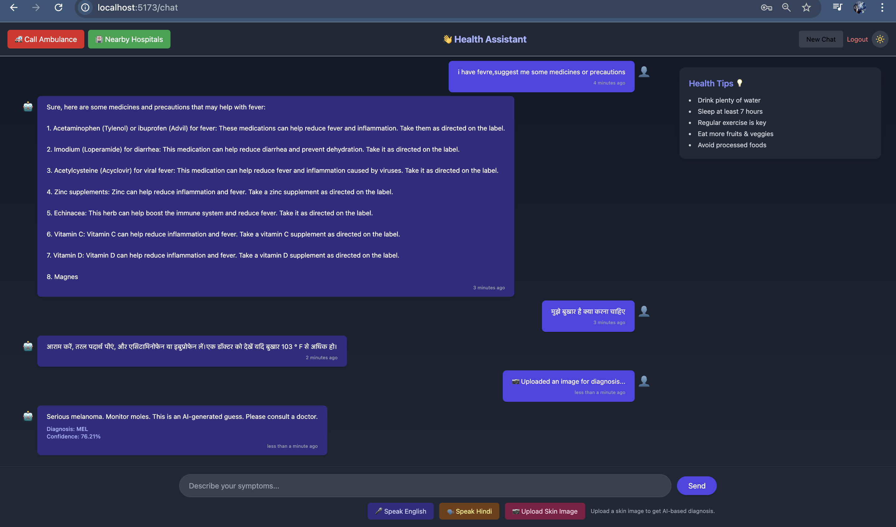
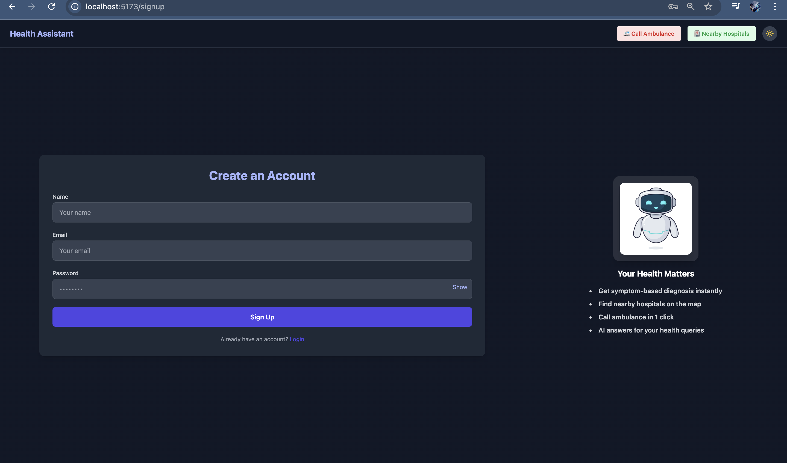
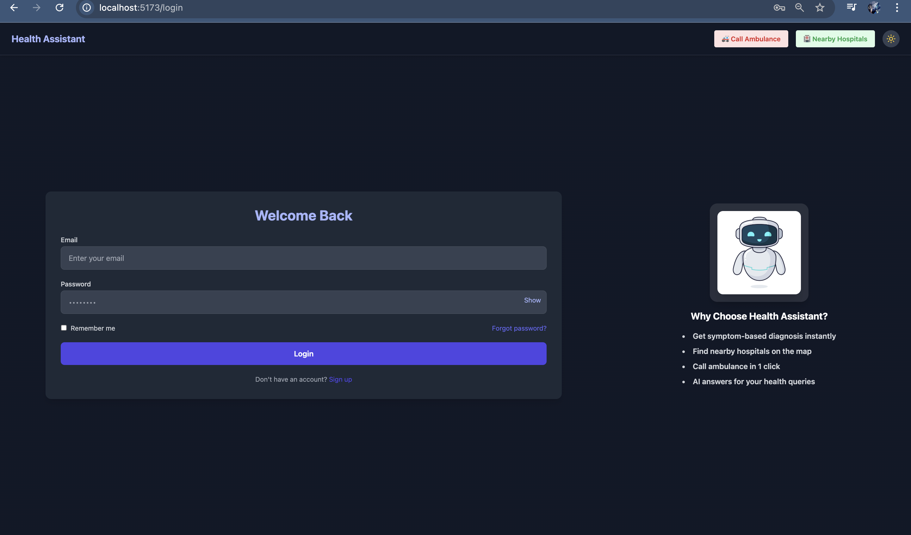

# 🩺 AI Health Assistant 🤖

> A full-stack MERN + Python-based AI Health Assistant that supports symptom-based queries, skin image diagnosis, multilingual voice input (English & Hindi), and stores user chat history.

---

## 🔍 Overview

This project simulates an AI-powered health assistant designed to **help users explore possible health issues** and **suggest basic information**, but **never diagnoses**. It also includes a **skin disease image classifier**, multilingual support, and **voice/text interaction**.

⚠️ **Note:** The live demo is currently under maintenance due to memory limits on free deployment platforms like Render. You can **run it locally** using the steps below.

---

## ✨ Features

✅ **Chatbot for Symptom Queries**  
✅ **Image-Based Skin Disease Classification**  
✅ **Multilingual Support (Hindi + English)**  
✅ **Voice Input & Text-to-Speech Output**  
✅ **User Authentication (Signup/Login)**  
✅ **Chat History per User**  
✅ **FAQ Matching using Sentence Similarity**  
✅ **Frontend: React + Redux Toolkit**  
✅ **Backend: Node.js + Express + Flask (AI)**  
✅ **Local LLM (TinyLLaMA) for offline AI replies**  
✅ **Skin Disease Detection using ResNet18**

---

## 🎥 Demo (Optional)

> ⚠️ Deployment on Render is currently facing memory issues.  
> 🔧 Please run locally for best results.

---

## 📸 Screenshots

| Symptom Chat | Login page | Signup page |
|--------------|---------------|-------------------|
|  |  |  |

---

## 🧠 Tech Stack

| Layer     | Tech Used                                        |
|-----------|--------------------------------------------------|
| Frontend  | React.js, Vite, Tailwind CSS, Redux Toolkit      |
| Backend   | Node.js, Express.js                              |
| AI Service| Flask, PyTorch, SentenceTransformers, TinyLLaMA |
| AI Models | TinyLLaMA, ResNet18 (skin), MiniLM (FAQ search)  |
| Voice     | Web Speech API (Browser), Google Translate API   |
| Auth      | JWT, bcrypt, MongoDB                             |

---

## 🚀 Run Project Locally

### 1️⃣ Clone the Repository

```bash
git clone https://github.com/Yogesh297/ai-health-assistant.git
cd ai-health-assistant

### 2️⃣ Start the Backend Server

```bash
cd server
npm install
npm run start

🛠️ Make sure to configure your .env file inside the server/ directory:
PORT=
MONGODB_URI=
JWT_SECRET=your_jwt_secret
JWT_EXPIRE=30d
EMAIL_USER=your_email@gmail.com
EMAIL_PASS=your_app_password
